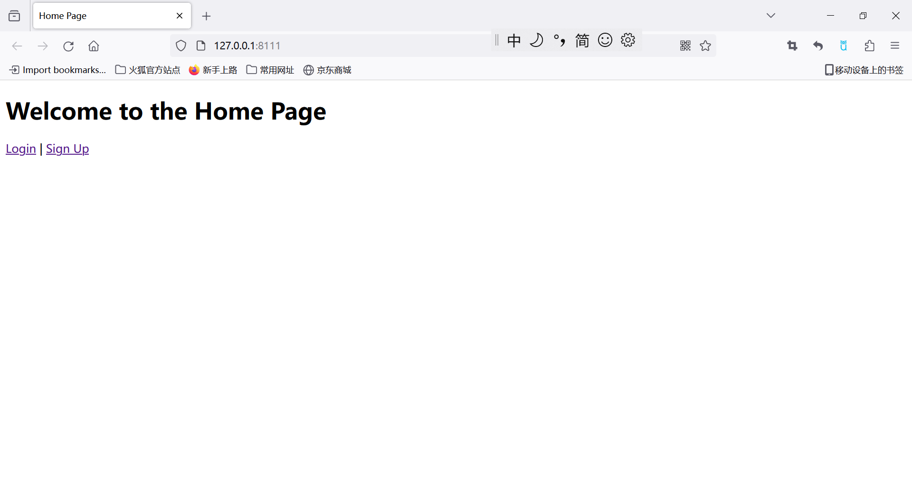
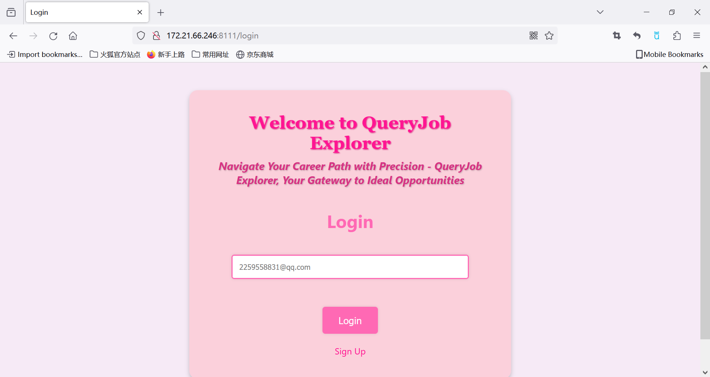
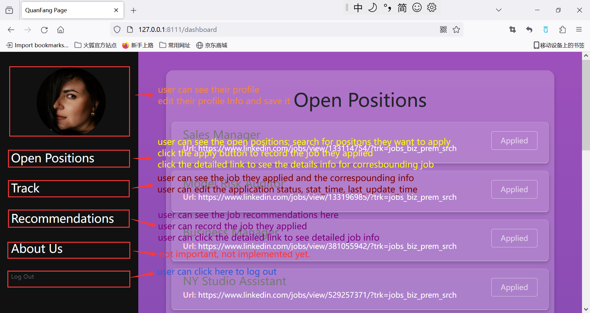
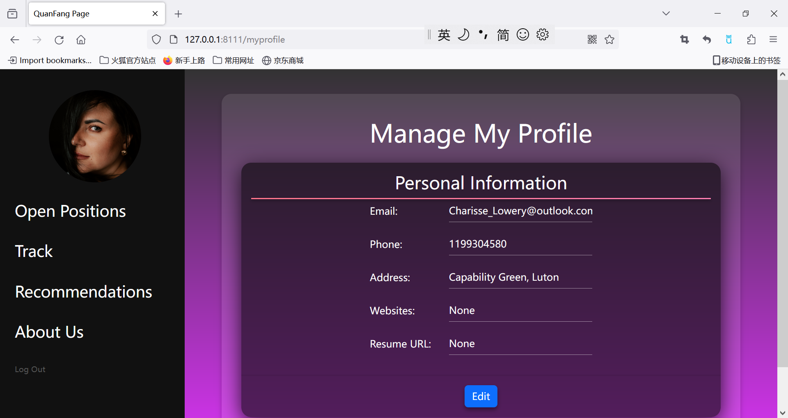
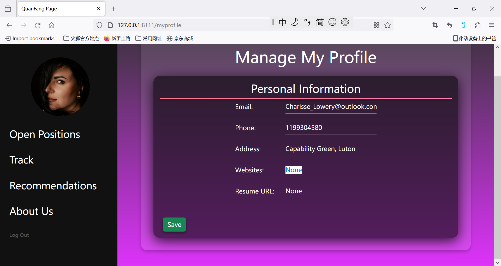
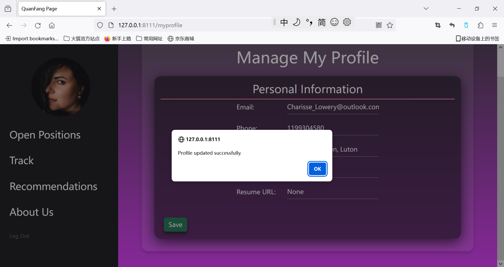
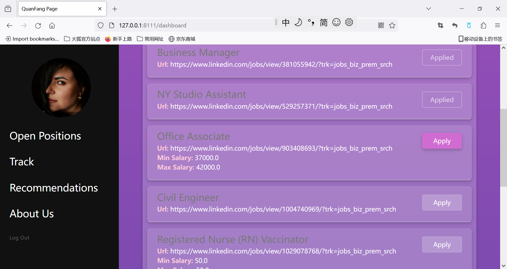
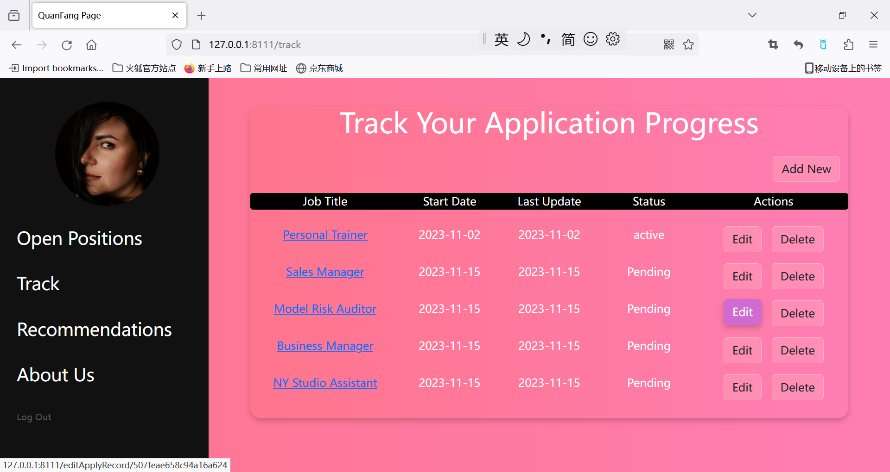
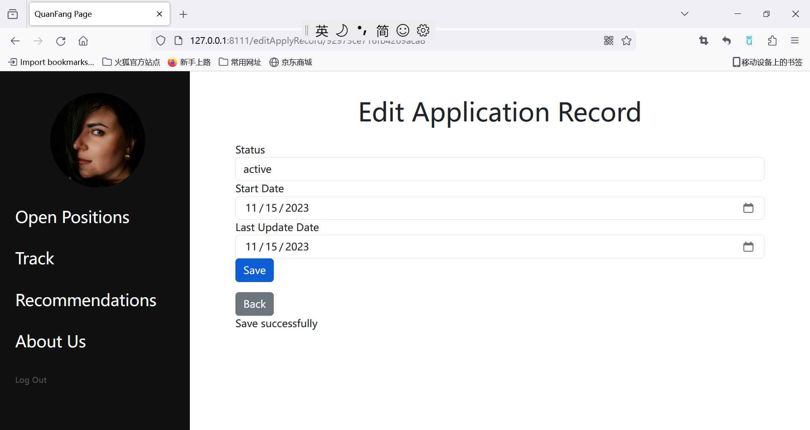

# 4111 Project1 Part3
***
## Brief Description
---
**QueryJob Explorer is an application that streamlines the process of aggregating open job positions and maintains a comprehensive record of our job applications.

Our users will have the flexibility to fine-tune their job searches using a variety of filter options, including location, company, and job title. Moreover, our application incorporates a sophisticated tracking system that enables users to maintain a comprehensive
history of their previous job applications and offers job recommendations.**
## Built With
---
+ Frontend
  - HTML/CSS
  - JavaScript
+ Backend
  - PostgreSQL
  - Python Flask
---
## Screen Shots

### Home Page/Sign Up/Log in

* Use the existing user email to login: 
Charisse_Lowery@outlook.com
* You can also use your own email to sign up, but you will find your Track page is empty. You can apply some on Open Positions and recheck the Track Page.

### Overview

* Once a user login successfully, he or she will see this page.

### My Profile

* User can click the profile image and go to see their profile info. 
* User can click the edit to do some modifications to their profile.

* User can do some modifications to their profile, but the email field is required.

* User can click save to save it successfully.

### Open Positions

* User can click the apply button to record that they have applied to that job.
* Once a apply button is clicked, it will be disenabled. If you click it by mistake, you need to go to the Track page to delete it. After you delete it, the apply button will be enabled again.
* advice1: Just display the job name and location(country,state,city) on this page because they are often not empty. Add a link to jobInfo page, in jobInfor Page, list the job's required skills, preferred skills and min/max salary.But I don't know how to include the company, industry, hr, referral.
* advice2: We need to implement search function.
* Table Included: 
  - Apply: if user click apply, we will generate a tuple and insert it into the Apply table.
  - Location/Job_Post: We select the job info and its location from the Job_Post table and Location table.
  - HR: We list the hr name and contact info on the job info page.
  - Employee/Referral: (Or we need a Connect Part, let the user to get referral from the employee???? a little complicated for me)
  - Comp_Indus Industry: ? in the search function? or in Connect Part

### Track Module

* The user can click the edit to go to the editApplyRecord.html page to edit and save. 
* The user can also click the delete button to delete the application.

* The user can edit the status, start date and last update date of the application.
* The user can click button save to save the modification and click back to go to the track page. The track page will reload it.

### Recommendation Module

### Connect Module?

