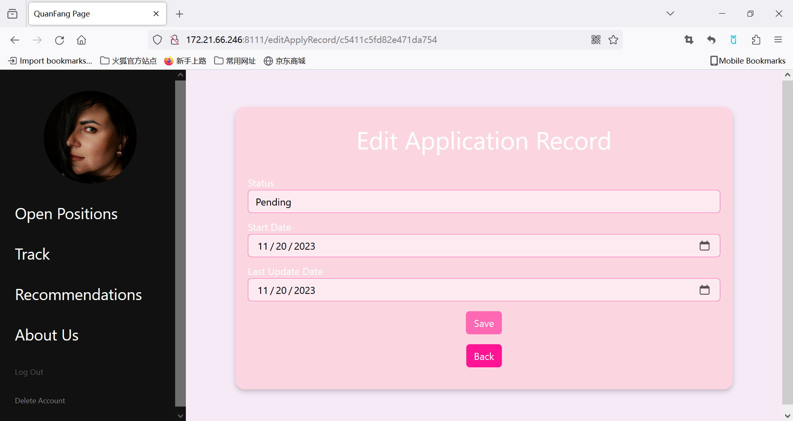

# 4111 Project1 Part3
## Database and Server Information
- Database: PostgreSQL
  - username: yz4326
  - password: 442835
- Server: 34.139.213.125:8111

## Brief Description
QueryJob Explorer is an application that streamlines the process of aggregating open job positions and maintains a comprehensive record of our job applications.

Our users will have the flexibility to fine-tune their job searches using a variety of filter options, including location, salary, and job title. Moreover, our application incorporates a sophisticated tracking system that enables users to maintain a comprehensive history of their previous job applications and offers job recommendations. 
## Built With
+ Frontend
  - HTML/CSS
  - JavaScript
+ Backend
  - PostgreSQL
  - Python Flask

## Two Most Interesting Page
### Open Positions Module

* In this Module, we have implemented the search function. On this page, we can see all the open positions. Our users will have the flexibility to fine-tune their job searches using a variety of filter options, including location, salary, and job title. We get the different inputs and match it with the information in table Job_Post.

* In addition, when our user press the button Apply, it means the user have applied to the job. So we will get the user's personID(which is stored in session when login successfully) and the correspounding jobID. Then we will generate a unique id for application_id, set the start_date and last_update_date to current date and status to Pending. Finally, we will insert it into the table Apply. And the button will be disabled unless you delete the apply record in Track Module.

* Moreover, we can have access to the detailed job information by clicking the job title. And after that, you will see the job's requirements, salary, location and so on. You can also find the company information and the employee's detailed information. In Job Info part, We use the job_id to find the job's detailed information in Job_Post and use the person_id in Job_Post to find the detailed information about the HR who post the job from HR and Employee table. In Compant part, we use the company_id in Employee table to get the company and it's correspounding information from table Comp_indus, Industry, Location, SitAt.

* Why interesting? This module is intriguing due to its dynamic interactivity and complex database operations. It allows users to search for job openings with various filters like location, salary, and job title, demonstrating advanced database querying. Furthermore, the application process is seamlessly integrated, where users can apply for jobs with their details being automatically updated in the database. This includes generating unique application IDs and updating statuses, showcasing sophisticated back-end data management. Additionally, the module provides detailed job and company information upon clicking a job title, involving multiple database joins to fetch comprehensive data, which exemplifies the intricate relationship between the user interface and the database.

### Recommendation Module

* In this project, we have developed a recommender system designed to assist applicants in identifying more fitting job opportunities. Our recommendation process hinges on the analysis of an applicant's past applications. By leveraging information from previous applications, we identify the most analogous applicants and subsequently suggest jobs that align with the preferences and patterns of these similar candidates.

* Given that applicants may have submitted multiple applications, our system places emphasis on the active applications that have been most recently updated. This prioritization is rooted in the belief that these updated applications better reflect users' current preferences and provide more accurate indications of potential matches.

* To achieve this, our recommender system employs a metric of similarity based on job titles, required skills, and preferred skills across previously applied job posts and other opportunities. The weighted cosine similarity is the chosen method for measuring the similarity between two job posts. Notably, the three features—job titles, required skills, and preferred skills—are assigned distinct weights to mirror their varying importance in real-world scenarios. This approach ensures a nuanced and comprehensive assessment of similarity, contributing to more refined and relevant job recommendations.

* Why interesting? The Recommendation Module stands out for its implementation of a personalized job recommender system. It leverages the history of a user's job applications to suggest suitable new positions, embodying a smart use of data analytics. The system prioritizes recent and active applications, reflecting the assumption that these more accurately represent current user preferences. What makes it particularly interesting is the use of weighted cosine similarity to determine job recommendations. This method considers job titles, required skills, and preferred skills with different weights, indicating a sophisticated algorithmic approach. It showcases the application's ability to provide tailored suggestions based on nuanced user behavior and preferences.

## Other Screen Shots

### Home Page/Sign Up/Log in

* Use the existing user email to login: 
Charisse_Lowery@outlook.com
* You can also use your own email to sign up, but you will find your Track page is empty. You can apply some on Open Positions and recheck the Track Page.
* Applicants table included.

### Overview

* Once a user login successfully, he or she will see this page.

### My Profile

* User can click the profile image and go to see their profile info. 
* User can click the edit to do some modifications to their profile.

* User can do some modifications to their profile, but the email field is required.

* User can click save to save it successfully.
* Applicants Table included

### Track Module

* The user can see his or her own application record. In database, we user the personID to get the applictaion info from Apply table.
* The user can click the edit to go to the editApplyRecord.html page to edit and save. 
* The user can also click the delete button to delete the application. Just get the application_id to delete the tuple in Apply table.

* The user can edit and save the status, start date and last update date of the application. When the user click button save, we will use the application_id to find the correspounding application in Apply table and update its information. After the modivication and saving it correctly, user can click back to go to the track page. The track page will reload the application related to the user.

### About Us Module

